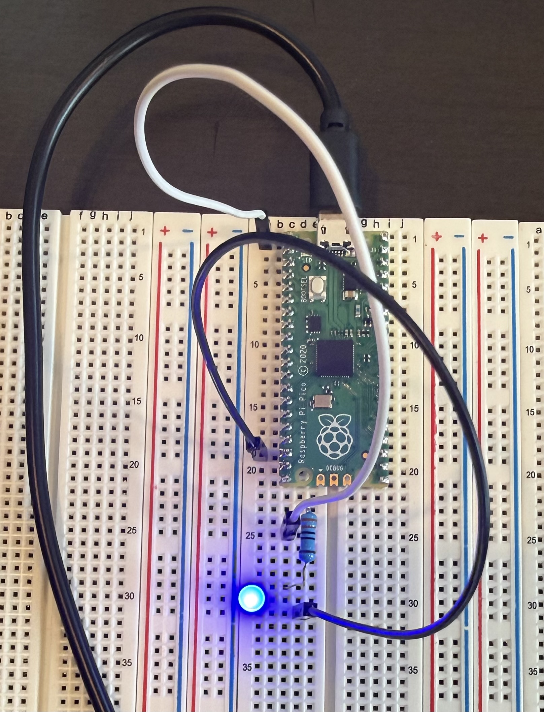

# Project 1

Use a Raspberry Pi Pico to blink an external LED on a breadboard using MicroPython, controlled through GPIO.  

Return to main menu [here](README.md)

## Toolchain

mpremote (no Thonny)  

### 🧰 Hardware Required

- Home PC w/Linux Operating System (OS)
- Raspberry Pi Pico (RP2040)
- Breadboard
- 1× LED
- 1× 330 Ω resistor
- 2x Jumper wires, each w/male ends
- USB cable (data-capable)

### 🔌 Hardware Wiring (Critical)

#### LED Polarity

- Long leg (anode) → positive
- Short leg (cathode) → ground

#### Physical Wiring Steps

1. Place the LED on the breadboard:
    - Long leg in one row
    - Short leg in a different row
2. Place the resistor:
    - One leg in the same row as the LED long leg
    - Other leg in a new row
3. Connect Pico GND → row with LED short leg
4. Connect Pico GP0 → row with free resistor leg

### 🧪 Hardware Sanity Check (Before Any Code)

Temporarily connect: Pico 3V3 → resistor → LED → GND

✅ LED must light solid, if not:
    - Flip LED orientation
    - Fix breadboard rows

Do not continue until this works.

### 💣 Step 1: Fully Erase Pico Flash (Important)

This step removes corrupted firmware/filesystems.

#### Download flash nuke 

wget https://datasheets.raspberrypi.com/soft/flash_nuke.uf2

#### Flash it

1. Unplug Pico
2. Hold BOOTSEL
3. Plug Pico in
4. Release BOOTSEL
5. Pico appears as RPI-RP2

cp flash_nuke.uf2 /Volumes/RPI-RP2/

Expected:
    - Drive disappears
    - Pico reboots
    - Pico is now blank

### 💾 Step 2: Install a Stable MicroPython Version

We intentionally use an older, proven-stable version.

#### Download MicroPython v1.19.1

wget https://micropython.org/resources/firmware/rp2-pico-20220618-v1.19.1.uf2

#### Flash it

1. Unplug Pico
2. Hold BOOTSEL
3. Plug Pico in
4. Release BOOTSEL

       cp rp2-pico-20220618-v1.19.1.uf2 /Volumes/RPI-RP2/

Pico reboots automatically.

### 🧑‍💻 Step 3: Install mpremote (Once)

    pip3 install --user mpremote

Verify:

    mpremote --help

### 🔗 Step 4: Connect to the Pico REPL

    mpremote connect /dev/ttyACM0 repl

You should see something like:

    MicroPython v1.19.1 on 2022-06-18; Raspberry Pi Pico with RP2040
    >>>

### ✅ Step 5: Verify MicroPython Is Healthy

In the REPL:

    import machine
    print("machine OK")

You should see:

    machine OK

If this works, GPIO is available.

### 💡 Step 6: Create the GPIO Pin

    from machine import Pin
    import time

    p = Pin(0, Pin.OUT)

### 🧪 Step 7: Manual LED Test (Proves Wiring)

When copying these 2 commands in terminal and running them, eye pico as your pasting code, LED will lite once then immediately turn off, you can easily miss this if eyeing PC on th paste.  

    p.value(1)   # LED ON
    p.value(0)   # LED OFF

If this works, wiring and pin choice are correct.

### 🔁 Step 8: Blink the LED (REPL)

Type this exactly, then press ENTER one extra time on a blank line

    while True:
      p.value(1)
      time.sleep(1)
      p.value(0)
      time.sleep(1)

⬅️ That final blank line is required in the REPL

🎉 Expected Result

    - LED ON for 1 second
    - LED OFF for 1 second

Repeats continuously

To stop:

Ctrl + C
